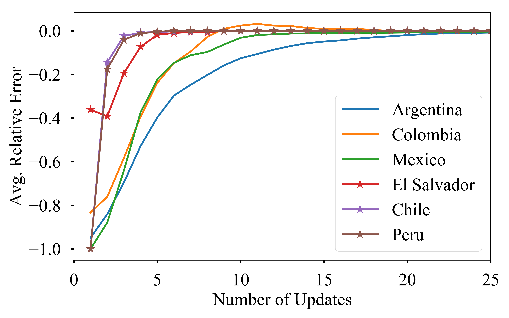
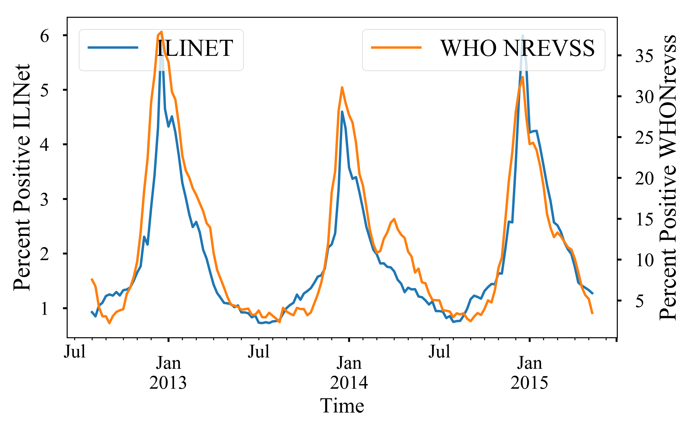
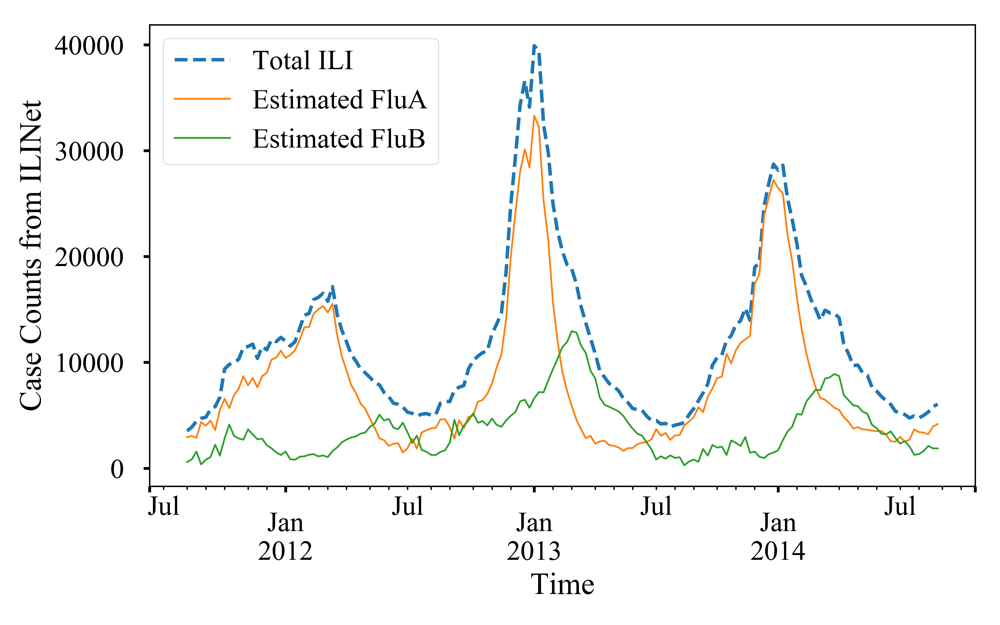

# how_not2_flu
Accompanying material for "What to Know before Forecasting the Flu" paper.


**Table of contents**

1. [Surveillance Instability](#surveillance-instability)
1. [Between Surveillance Deviations](#between-surveillance-deviations)
2. [Within Surveillance Deviations](#strain-deviations)
4. [Drop off of surveillance](#surveillance-drop-off)
5. [Christmas Effect](#christmass-effect)
6. [Data and Figures](#data)

- - -

# Surveillance Instability

Surveillance data is generally unstable. Usually it takes a number of updates
from the agency before the surveillance data gets stabilized.  This
instability can vary from one country to another (within a single network) as
well as between networks. Here we analyze the instability of two different kinds
of surveillance networks:

1. [PAHO](#paho-Instability): FluNet network for ILI (a lab based system)
2. [CDC](#cdc-Instability): ILINet network for ILI (an outpatient reporting system)

As can be seen both networks show surveillance instability.

## PAHO-Instability


PAHO provides lab based surveillance feeds. We show the phenomenon of
`surveillance drop-off` on this network. PAHO updates for several Latin
American countries were collected daily from `2012-10` to `2013-10`.  ILI
estimates are generally updated at irregular intervals. We assumed the estimate
for a particular country for an epi week as available from the last update as
the true value and calculated percentage relative error as:

$\text{Error} = \frac{\text{data} - \text{last_update}}{\text{last_update}}$

The snapshot of the daily downloads can be found in [PAHO
updates](./data/PAHO_2013-10-10.xlsx). We can show the relative error as 
a function of update as given below:


As can be seen in the figure countries fall nicely in two groups as slowly
stabilizing countries  (such as `Colombia` and `Peru`) and quickly stabilizing
countries (such as `Argentina` and `El Salvador`).

## CDC Instability

CDC historical updates for national regions can be accessed from 
[cdc archives](http://www.cdc.gov/flu/weekly/weeklyarchives2013-2014/data/senAllregt09.htm)
(click on the link for an example). A snapshot of the dataset can be 
found in [CDC historical archive snapshot](./data/cdc-historical-2010-2015.csv)

### Animated CDC Updates

An animation of how the CDC updates happens for various epi weeks is shown
below. We animate the updates for 2013-2014 season for various reporting week
here:


### CDC Instability Horizon
Similar to PAHO, we can plot the relative error of updates as a scatter plot as 
shown below. We also plot the mean relative error in this figure.


As can be seen, similar to PAHO a number of updates is required before the 
value stabilizes. However, CDC data for USA is found to be `fast stabilizing`. 


- - -


# Surveillance Drop-off

In our opinion piece we posited that, Post-peak the surveillance efforts drops. 
We elucidate this by plotting the
scatter plot of the CDC ILINet reported number of providers as a function of
season week. As the scatter plot shows, the number of providers decreases
sharply at around season week $33$. We identified this point by finding the
inflection point of the averaged and smoothened CDC ILINet number of providers.
The inflection point is also found via smoothened version to account for
sporadic variations. The code snippet for finding the inflection point is given
below. The data archive can be found in [cdc real time
data snapshot](./data/cdc-combined-national-2015-05-25.csv)


```python
selected_cdc = cdc_data.query('season in [2010, 2011, 2012, 2013, 2014]')

# Smoothing data
span_size = 4
avg_providers = selected_cdc.groupby('season_week').agg({'NUM. OF PROVIDERS': 'mean'})
smooth_providers = pd.ewma(avg_providers, span=span_size)

# Calculating gradients on smoothened data
provider_summary = pd.DataFrame(index=smooth_providers.index)
provider_summary['average'] = smooth_providers
provider_summary['grad2'] = np.gradient(np.gradient(smooth_providers.values.flatten()))
provider_summary['grad2sign'] = np.sign(provider_summary['grad2'])

# Calculating smoothened inflection point
provider_summary['inflect'] =  pd.rolling_sum(provider_summary['grad2sign'], 
                                              window=span_size).shift(-span_size + 1)

# Inflection point = first point where you get a sum of span_size
inflection_point = provider_summary[provider_summary['inflect'] == span_size].index[0]
```

The resultant scatter plot is shown below:


- - -

# Between Surveillance Deviations 

Often times, there are deviations in estimated ILI incidence for two different
networks for the same region. We illustrate this for CDC by comparing `ILINet` 
against `WHO NREVSS`. We show this comparison for the national region. However, 
similar analysis can be done for other regions as well. We compare the
estimates from two different networks below:
The data archive can be found in [cdc
real time data snapshot](./data/cdc-combined-national-2015-05-25.csv)



- - -

# Strain Deviations

Similar to surveillance deviations, there could be deviations in ILI patterns
for different strains that is broadly encompassed by the term ILI. 

Strain estimates can be obtained from `WHO NREVSS` (which is a lab based
surveillance system). We scale the strain estimates to ILINet reported levels
and compare the incidence of total ILI vs Flu A and Flu B. 

The code snippet for the scale conversions is given below:

```python
# **************************************************************
#                   MANIPULATORS
# **************************************************************
# Get ratios
def get_ratios(X, col1='FLUA', col2='B', epsilon=1, suffix='_per'):
    """ lambda funtion to get ratios of col1 and col2 as percentage.
    """
    denom = X[col1] + X[col2] + epsilon
    num1 = ((X[col1] + epsilon)/ denom).fillna(0)
    num2 = ((X[col2] + epsilon)/ denom).fillna(0)
    return pd.DataFrame({col1+suffix: num1,
                         col2+suffix: num2})


# Get ILINET values
def get_values(X):
    """ lambda funtion to get ILINET VALUES
    """
    
    return (np.round(X['FLUA_per'] * X['ILITOTAL']),
            np.round(X['B_per'] * X['ILITOTAL']))


# ***************************************************************
#                   Scaling of WHO data to ILINet Scale
# ***************************************************************
combined_who_columns = [u'PERCENT POSITIVE', u'B',
                        u'FLUA', u'FLUA_per', u'B_per']
# calculating ratios of strains
cdc_who[['FLUA_per', 'B_per']] = (get_ratios(cdc_who, epsilon=0)
                                  [['FLUA_per', 'B_per']])
# merging frames
combined_df = (cdc_net.join(cdc_who[combined_who_columns]))['2004':]
# Scaling ILINet according to strain ratios
combined_df['ILI_FLUA'], combined_df['ILI_FLUB'] = zip(*combined_df.apply(get_values, axis=1)) 
```
The raw [ILINet data](./data/cdc-ILINet-national-2015-05-25.csv) and 
[NREVSS data](./data/cdc-WHO_NREVSS-national-2015-05-25.csv) is merged 
together to [Combined data](./data/cdc-combined-national-2015-05-25.csv) 
for public perusal.

This can be show pictorially as given below which shows a phase deviation
between Flu B and ILI


- - -

# Christmas Effect

Surveillance measures can often suffer from variations such as holiday periods.
During holidays, such as Christmas in USA, people may chose to visit hospitals for only
essential visits (example: people may not visit for elective surgeries). 
As a result, although the total number of patients may decrease, the number of 
ILI related visits may remain the same. This contributes to an inflated
measure of `Percent Weighted ILI` which is used by CDC to determine the severity
of a flu season and lead to a double peaked season.

The code snippet for processing the data to verify the `Christmass Effect` is
given below:

```python
def normalize(df):
    return (df - df.mean(axis=0)) / df.std(axis=0)

used_cdc = cdc_data.query('2004 < season < 2015')

# Normalizing ILI and TOTAL to plot on same scale
cdc[['NormalizedILI', 'NormalizedTOTAL']] = (cdc[['ILITOTAL', 'TOTAL PATIENTS', 'season']].groupby('season')
                                             .apply(normalize)[['ILITOTAL', 'TOTAL PATIENTS']])

metrics = ['NormalizedTOTAL', 'NormalizedILI', '% WEIGHTED ILI']

# Calculating means for each week
meanDF = used_cdc.groupby('WEEK').mean()[metrics]


# Reindexing the plotting dataframe to plot from 40-39 weeks
x=np.r_[np.arange(40, 53), np.arange(1,40)]
other_x = np.arange(len(x))
index_map = dict(zip(x, other_x))
plot_meanDF = meanDF.ix[x, :].reset_index()
```

`Christmass effect` is highlighted below which shows that a dip in normalized
total visits coupled with a steady ILI related visit contributes to an inflated
percent ILI, historically around week 52 for ILINet in USA.


- - -

# List of Data Snapshots

1. [CDC Historical Archives](./data/cdc-historical-2010-2015.csv)
2. [CDC ILINet](./data/cdc-ILINet-national-2015-05-25.csv)
3. [CDC WHONREVSS](./data/cdc-WHO_NREVSS-national-2015-05-25.csv)
4. [PAHO](./data/PAHO_2013-10-10.xlsx)
5. [CDC Combined Surveillance
   File](./data/cdc-combined-national-2015-05-25.csv)

6. Performance Measures:

    1. [Single Source accuracy](./data/singleSource.csv)
    2. [Multiple Source accuracy](./data/MultipleSource.csv)
